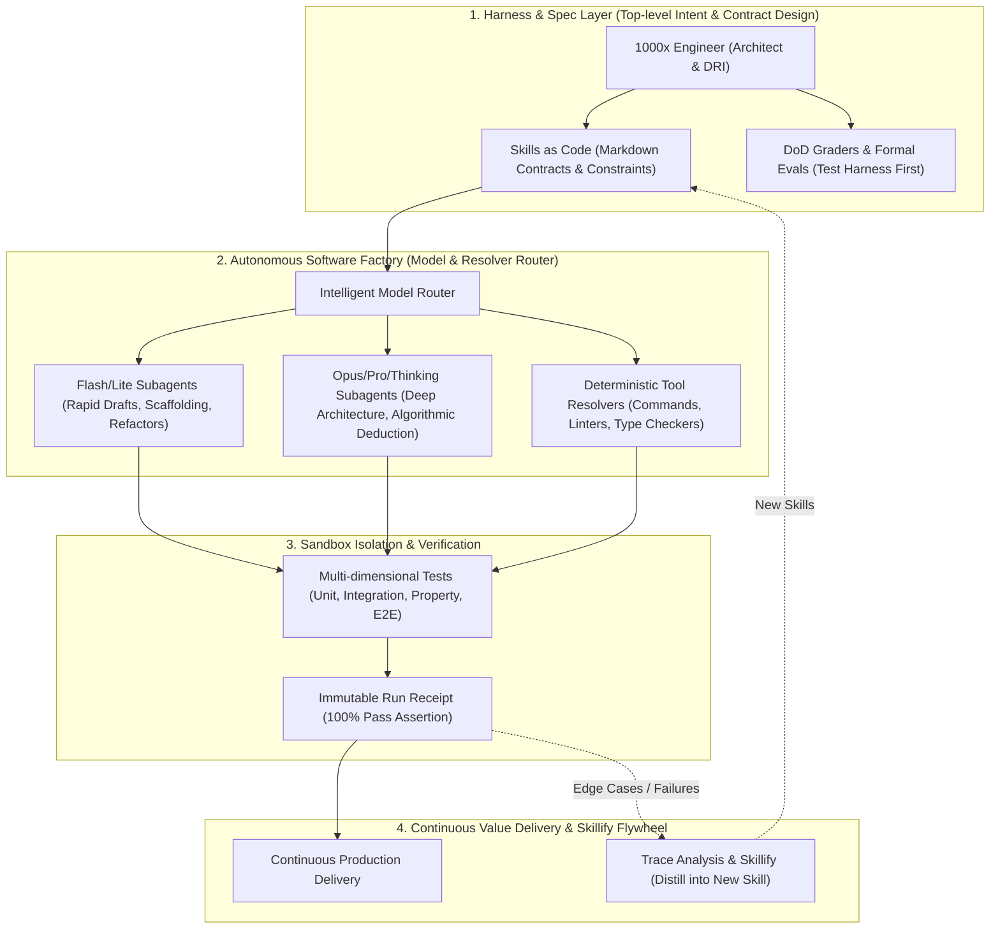

# 1000x Engineer: Autonomous Software Factory Protocol

> **Core Thesis:** The 1000x Engineer operates as the **Commander and Harness Architect** of an Autonomous Software Factory. Instead of manually writing and line-by-line debugging code, you write high-density Markdown skill contracts (Skills as Code), enforce deterministic test harnesses (Evals First), orchestrate multi-agent parallel loops ("Boil the Ocean"), audit immutable Run Receipts, and distill execution traces into compounding skills.

---

## 4-Layer Autonomous Software Factory Architecture

---

## The 5-Step SOP for AI-Engineering Tasks

When assigned any complex engineering task, strictly execute the **5-Step SOP**:

### Step 1: Forward Deploy & Trace Capture (前线探查与痛点捕获)
- Do not make blind assumptions. Investigate the live environment, real data inputs, error traces, and system boundaries first.
- Capture baseline metrics, existing failure logs, edge cases, and environment constraints.
- See detailed procedure in [SOP Step 1 Guide](./references/sop-5-step-guide.md#step-1-forward-deploy--trace-capture).

### Step 2: Write Skills as Code & Semantic Contracts (契约固化)
- Define high-density Markdown contracts specifying:
  1. **Strict Input/Output Schemas** and data formats.
  2. **Invariants & Non-Negotiables** (e.g., zero regression, strict typing, security guardrails).
  3. **Forbidden Anti-Patterns** (e.g., hardcoded secrets, unchecked async calls).
  4. **MECE Boundaries** (Mutually Exclusive, Collectively Exhaustive interface segregation).
- Template: [Skill Contract Template](./resources/skill-contract-template.md).

### Step 3: Build Evals & Deterministic Test Harness First (搭建断言防线)
- **Zero code generation before test harness setup.**
- Write comprehensive test suites before modifying or implementing production code:
  - Unit tests for core domain logic.
  - Property-based tests for boundary values.
  - Integration/E2E test harness running in sandboxed isolation.
  - Type-checking and strict linter rules.
- Define unambiguous **Definition of Done (DoD)** with automated grading criteria.
- Template: [Eval Harness Template](./resources/eval-harness-template.md).

### Step 4: Launch Autonomous Closed Loops & Subagent Routing (发射自主闭环)
- Execute the closed self-healing loop: `Trigger -> Execute -> Verify -> Commit`.
- Apply **Adaptive Compute & Model Routing**:
  - **Flash / Lite Models**: Route low-complexity tasks (boilerplate generation, docstring creation, data conversion, formatting).
  - **Thinking / Pro Models**: Route architectural design, core concurrency, algorithmic deduction, and complex refactors.
- **Parallel Multi-Agent Dispatch ("Boil the Ocean")**:
  - Split broad domains into decoupled sub-problems.
  - Concurrently dispatch specialized subagents to tackle database layer, API routes, frontend UI, and test suites in parallel.
  - See [Model Routing & Topology Matrix](./references/model-routing-matrix.md).

### Step 5: Audit Receipts, Not Code (审查收据而非代码) & Skillify Flywheel
- **Stop manual line-by-line reading**: Audit the machine-generated **Run Receipt** (`RUN_RECEIPT.md`):
  - 100% test pass rate.
  - Linter & type check zero-error status.
  - Performance and resource usage benchmarks.
- **Skillify Flywheel**:
  - If unexpected errors occurred and were solved during the loop, extract the execution trace.
  - Convert lessons learned into an updated `SKILL.md` or new skill package to permanently eliminate recurrence.
  - Use [Skillify Flywheel Guide](./references/skillify-flywheel.md) and [Receipt Template](./resources/run-receipt-template.md).

---

## Quick Reference: Commands & Tools Integration

| Phase | Core Tool / Action | Goal |
| :--- | :--- | :--- |
| **Harness Setup** | `write_to_file` -> `tests/*` | Establish automated eval gates |
| **Parallel Orchestration** | `invoke_subagent` | Parallel subagent execution across layers |
| **Deterministic Verification**| `run_command` (pytest / npm test / cargo test) | Run sandboxed multi-dimensional tests |
| **Receipt Generation** | `python scripts/generate_run_receipt.py` | Generate verified, reproducible Run Receipt |
| **Skill Distillation** | `python scripts/extract_skill_trace.py` | Distill execution traces into reusable skill contracts |

---

## Anti-Patterns to Strictly Avoid

1. ❌ **Vibe Coding without Evals**: Allowing agents to generate code without automated tests or formal verification.
2. ❌ **Prompt Fatigue & Micromanagement**: Babysitting every line of code instead of writing rigorous specification contracts.
3. ❌ **Orchestration Tax Leakage**: Spawning unbounded subagents without clear MECE interfaces, causing coordination overhead.
4. ❌ **Ignoring Failure Traces**: Solving a bug once without codifying the fix into a regression test or a reusable skill.
