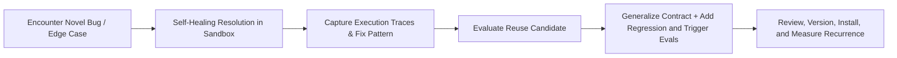

# The Skillify Flywheel: Distilling Traces into Compounding Knowledge

The defining characteristic of a 1000x Engineer and an Autonomous Software Factory is **systemic knowledge compounding**. Treat a difficult edge case, non-trivial bug, tooling quirk, or novel architecture as a Skillify candidate; codify it only when the pattern is reusable and its expected value exceeds discovery and maintenance cost.

---

## 1. The Skillify Lifecycle

---

## 2. When to "Skillify"

Consider Skillify when one or more of these apply and the pattern is likely to recur:
1. **Multi-turn Debugging**: An issue took >2 failed attempts before succeeding.
2. **Environment/Tooling Quirks**: Discovered a specific flag, dependency conflict, or OS nuance (e.g., Windows path formatting, shell escaping).
3. **Reusable Architecture Patterns**: Created a custom scaffolding pattern (e.g., CQRS handler, WebSocket multiplexer).
4. **Domain Invariants**: Discovered an unspoken business constraint that must always be enforced.

---

## 3. How to Extract and Package a New Skill

1. **Distill Transcript/Logs Manually**: Identify the problem signature, root cause, proven solution, invariants, and evidence. The bundled script does not parse transcript files.
2. **Abstract the Core Procedure**: Remove ephemeral details (specific file names, line numbers, temporary IDs) and replace them with parametric steps.
3. **Format Frontmatter & SKILL.md**:
   - Write an explicit, third-person `description` explaining **when** to activate the skill.
   - Place into `.agents/skills/<skill-name>/SKILL.md`.
4. **Scaffold and Attach Graders/Evals**: Pass the distilled fields to [`extract_skill_trace.py`](../scripts/extract_skill_trace.py), review its generated `SKILL.md`, and add an automated regression test to `tests/` or the project eval suite.
5. **Test Discovery Boundaries**: Test positive activation, negative non-activation, and ambiguous cases in a fresh context.
6. **Review Before Installation**: Assign ownership, version, and review date. Install only after the procedure and evals pass; then measure whether recurrence or lead time improves.
