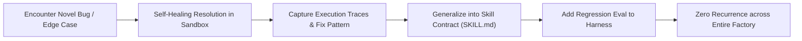

# The Skillify Flywheel: Distilling Traces into Compounding Knowledge

The defining characteristic of a 1000x Engineer and an Autonomous Software Factory is **systemic knowledge compounding**. When an agent encounters an edge case, solves a non-trivial bug, or creates a novel architecture, that knowledge must be codified into a permanent skill.

---

## 1. The Skillify Lifecycle

---

## 2. When to "Skillify"

Trigger the Skillify process whenever:
1. **Multi-turn Debugging**: An issue took >2 failed attempts before succeeding.
2. **Environment/Tooling Quirks**: Discovered a specific flag, dependency conflict, or OS nuance (e.g., Windows path formatting, shell escaping).
3. **Reusable Architecture Patterns**: Created a custom scaffolding pattern (e.g., CQRS handler, WebSocket multiplexer).
4. **Domain Invariants**: Discovered an unspoken business constraint that must always be enforced.

---

## 3. How to Extract and Package a New Skill

1. **Extract Transcript/Logs**: Use `scripts/extract_skill_trace.py` to pull the key reasoning and actions from `transcript.jsonl` or execution logs.
2. **Abstract the Core Procedure**: Remove ephemeral details (specific file names, line numbers, temporary IDs) and replace them with parametric steps.
3. **Format Frontmatter & SKILL.md**:
   - Write an explicit, third-person `description` explaining **when** to activate the skill.
   - Place into `.agents/skills/<skill-name>/SKILL.md`.
4. **Attach Grader/Eval**: Add an automated regression test into `tests/` or the project eval suite.
