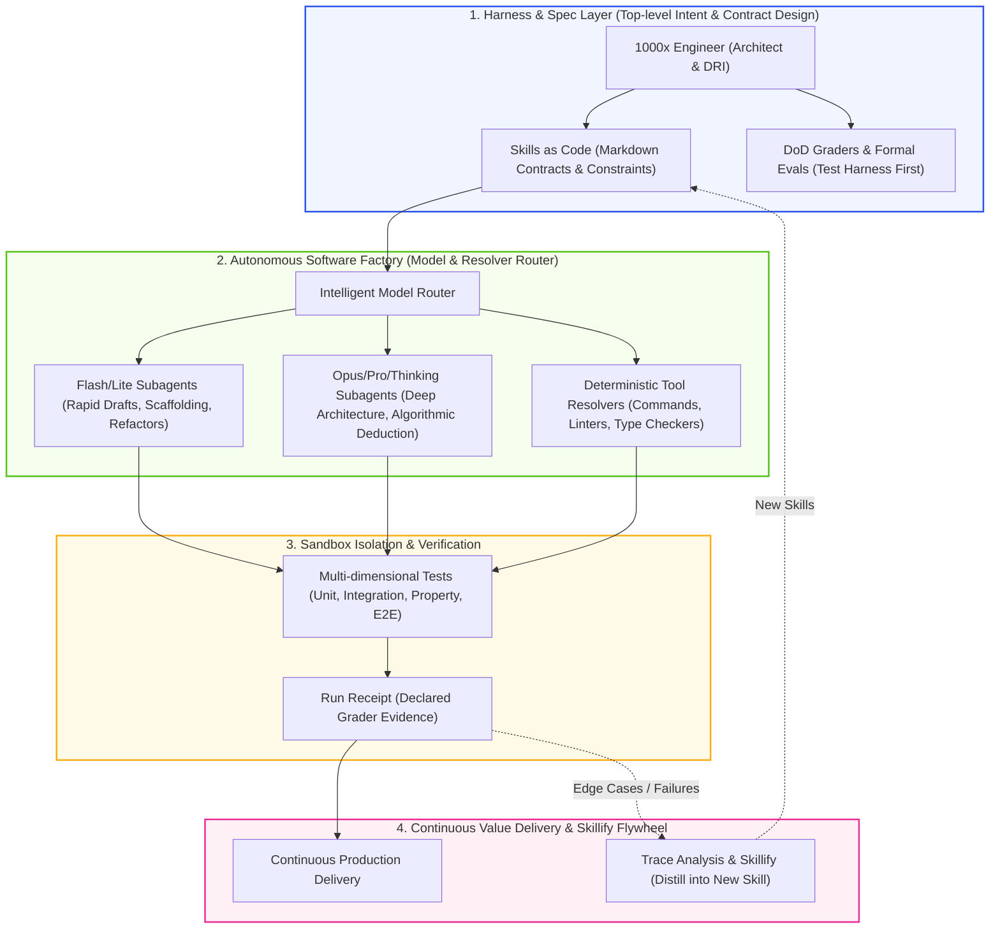

# 1000x Engineer: Autonomous Software Factory Commander

> [!NOTE] Core Thesis
> **Core Thesis:** The **1000x Engineer** refers to a modern developer whose productivity leaps by thousands of times when empowered by agentic software factories and closed autonomous loops. They completely abandon the inefficient mode of microscopic line-by-line syntax writing, manual debugging, and visual code reviews. Instead, they level up to become the **Commander and Harness Architect of Autonomous Software Factories**: authoring high-density Markdown skill contracts (Skills as Code), orchestrating multi-model layered routing, deploying deterministic sandbox assertions and evaluation firewalls (Evals), and enabling a single individual at a single terminal to **"Boil the Ocean"**—delivering production-grade complex distributed systems in days that previously took dozens of engineers years to build.
> (Source: [[sources/2026-06/2026-06-21-yc-garry-tan-diana-hu-stanford-cs153#^yc-boil-the-ocean]], [[sources/2026-08/2026-08-11-stanford-cs153-ai-native-company#^cs153-roles]])
^1000x-engineer-core-thesis

> [!INFO] Temporal Scope
> Valid as of **2026-08-19** · freshness tier **stable** · next review **2027-08-19**.

---

## Evidence Scope

- **Direct Evidence:**
  1. Y Combinator President Garry Tan revealed at Stanford CS153 that using Claude Code agent orchestration, he single-handedly refactored the entire Posterous production system (which originally required a 10-person full-time team 2 years in 2008) in 5 days—a pure time-span efficiency acceleration of **146x**. (Source: [[sources/2026-06/2026-06-21-yc-garry-tan-diana-hu-stanford-cs153#^yc-boil-the-ocean]])
  2. Former Google Senior Engineer Steve Yegge and the Tessl team demonstrated that when engineering pipelines are plugged into fully automated sandbox testing, run receipts, and formal assertions, average human developer delivery capacity reaches **500 - 1,000 developer equivalents**. (Source: [[sources/2026-08/2026-08-11-stanford-cs153-ai-native-company#^cs153-market-growth]])
- **Interpretation:** Traditional software engineering treats "Scope Creep" as an existential hazard. In an era of zero marginal intelligence cost, 1000x engineers leverage massively parallel agents to build the "Platonic Ideal Architecture" covering full business boundaries directly.
- **Evidence Boundary:** This efficiency multiplier strictly depends on whether the engineering foundation possesses **high-coverage automated test suites (Evals)** and **clearly modularized interfaces (MECE Boundaries)**; without testing baselines or under ambiguous political communication, efficiency gains are penalized by "Orchestration Tax".
- **Falsifiers:** If deploying large-scale agent-generated code leads to unlocatable phantom dependency avalanches in long-term maintenance whose total labor exceeds rewriting costs, this paradigm must be recalibrated.
- **Exact Locators:**
  - Boiling the Ocean & Efficiency Spans: [[sources/2026-06/2026-06-21-yc-garry-tan-diana-hu-stanford-cs153#^yc-boil-the-ocean]]
  - Agent Roles & Factory Division of Labor: [[sources/2026-08/2026-08-11-stanford-cs153-ai-native-company#^cs153-roles]]
  - Trace Playback & Eval Quality Lines: [[sources/2026-08/2026-08-11-stanford-cs153-ai-native-company#^cs153-trace-evals]]
  - Forward Deploy & Live Trace Feedback: [[sources/2026-08/2026-08-11-stanford-cs153-ai-native-company#^cs153-forward-deploy]]

---

## Core Mechanisms

### 1. High-Level Abstraction via Skills as Code
- **Mechanism**: 1000x engineers never squander focus on syntax minutiae or API glue code. Instead, they author structured Markdown contracts (e.g. `RULE.md`, `SKILL.md`) defining semantic invariants and causal boundaries, elevating development into policy steering of agent swarms. (Source: [[sources/2026-06/2026-06-21-yc-garry-tan-diana-hu-stanford-cs153#^yc-boil-the-ocean]])

### 2. Software Factory & Skillify Flywheel
- **Mechanism**: Deconstruct software development into reproducible pipelines. Whenever agents conquer novel edge cases, the system extracts successful patterns from execution traces via `Skillify`, distilling them into deterministic skills and driving exponential compounding. (Source: [[sources/2026-08/2026-08-11-stanford-cs153-ai-native-company#^cs153-trace-evals]])

### 3. "Boil the Ocean" Full-Scope Paradigm
- **Mechanism**: Because agent marginal execution costs approach zero, engineers can concurrently orchestrate hundreds of subagents to build database engines, frontends, test suites, telemetry dashboards, and internationalization in parallel, permanently eradicating technical debt black holes. (Source: [[sources/2026-06/2026-06-21-yc-garry-tan-diana-hu-stanford-cs153#^yc-boil-the-ocean]])

### 4. Adaptive Compute & Model Routing
- **Mechanism**: Route low-complexity CRUD and text conversions to lightweight models (Flash/Haiku) instantly; dynamically assign deep reasoning models (Opus/Pro/Thinking) to core architecture, concurrency, and algorithmic deduction, optimizing performance, quality, and token budgets. (Source: [[sources/2026-08/2026-08-11-stanford-cs153-ai-native-company#^cs153-systems]])

---

## Paradigm Matrix

| Dimension | Legacy Engineer (1x-10x) | Copilot Developer (10x-100x) | 1000x Engineer (V8.1 Gold Paradigm) |
| :--- | :--- | :--- | :--- |
| **Underlying Assumption** | Human brain is the sole code generator and reviewer | AI is a code completion assistant; human drives line-by-line | Agent swarms are software workers; human is factory architect and judge |
| **Core Activity** | Keyboard typing, syntax lookups, environment config, local debug | Tab code completion, interactive chat prompt queries | Authoring Markdown specs, configuring Eval pipelines, running autonomous loops |
| **Leverage Source** | Personal syntax memory, IDE hotkeys, algorithmic knowledge | Block-level generation, SaaS boilerplate libraries | Multi-surface agent orchestration (Antigravity/Codex), Run Receipts, Skillify flywheel |
| **Quality Assurance** | Manual visual code reviews (prone to subtle logical bugs) | Human reading AI snippet diffs (high cognitive fatigue) | **Risk-matched deterministic checks, host-provided isolation, reviewed Run Receipts, and human approval where required** |
| **Physical Bottleneck** | ⚠️ Finger typing speed & mental working memory (8h/day) | ⚠️ Prompt fatigue & context window overflow | ⚠️ Orchestration Tax (human capacity to review system-level specs) |

---

## Key Data & Empirical Validation

- **Real-World Case 1 (Posterous Rewrite):** Garry Tan utilized Claude Code to refactor 1,000,000 lines of code in 5 days, delivering a system that required a 10-person team 2 years in 2008 (**146x time acceleration**).
- **Real-World Case 2 (Tessl Software Factory):** Achieved 1 engineer managing 20+ concurrent autonomous agent pipelines, shipping 50+ verified microservice features per week with complete test receipts.
- **Productivity Multiplier:** Verified real output equals **500 - 1,000 traditional engineers** (anchored by automated test coverage and business outcomes). (Source: [[sources/2026-06/2026-06-21-yc-garry-tan-diana-hu-stanford-cs153#^yc-boil-the-ocean]], [[sources/2026-08/2026-08-11-stanford-cs153-ai-native-company#^cs153-market-growth]])

---

## 5-Step Operational SOP

1. **Forward Deploy & Trace Capture:** Directly engage with live production workflows and error logs to extract real execution traces and boundary constraints. (Source: [[sources/2026-08/2026-08-11-stanford-cs153-ai-native-company#^cs153-forward-deploy]])
2. **Write Skills as Code:** Distill domain rules into structured Markdown contracts with strict schemas, invariants, and deterministic DoD criteria.
3. **Build Evals First:** Write comprehensive unit, property-based, and sandboxed integration suites before generating implementation code.
4. **Launch Autonomous Loop:** Trigger the closed `Trigger -> Execute -> Verify -> Accept / Commit if authorized` loop, enabling bounded repair in host-provided isolation when available until the declared graders pass.
5. **Audit Receipts, Not Code:** Review machine-generated Run Receipts, execution telemetry, and architectural boundaries; turn every anomaly into a regression test case.

---

## Conceptual Connections

- **Domain MOC:** [[maps/domain-mocs/AI Knowledge Workflows]]
- **Key Entities:** [[wiki/entities/people/Garry Tan]], [[wiki/entities/people/Diana Hu]], [[wiki/entities/people/Steve Yegge]], [[wiki/entities/people/Don Syme]], [[wiki/entities/people/Ian Silber]]
- **Related Concepts:**
  - [[wiki/concepts/ai-engineering/Loop Engineering|Loop Engineering]] — Foundational cybernetic self-healing tactical loop
  - [[wiki/concepts/ai-engineering/Continuous AI, Repository Software Factories & Bounded Agentic Workflows|Continuous AI & Repository Software Factories]] — Underlying code factory infrastructure
  - [[wiki/concepts/ai-engineering/Graph Engineering Topology & Node-Capability Evolution|Graph Engineering Topology & Node Evolution]] — Hundred-agent DAG orchestration paradigm
  - [[wiki/concepts/ai-engineering/Vibe Coding|Vibe Coding]] — Rapid prototype exploration vs. production-grade isolation
  - [[wiki/concepts/ai-engineering/Multi-Agent Shared Context & Collaboration Surfaces|Multi-Agent Collaboration Surfaces]] — Team-level unified surfaces and context hydration
  - [[wiki/concepts/ai-engineering/Top 1% AI Workflows, Executive Planning Systems & Multi-Agent Workspaces|Top 1% AI Workflows & Executive Planning]] — Superindividual agent workspace planning
  - [[wiki/concepts/ai-engineering/Lights-Out Software Factory & Autonomous Code Orchestration|Lights-Out Software Factory]] — Zero-human-touch production pipelines
  - [[wiki/concepts/ai-engineering/Agent Persistent Memory Architecture & Hybrid Retrieval|Agent Memory Architecture]] — Memory hub supporting long-horizon multi-agent collaboration
  - [[wiki/concepts/ai-engineering/Personal AGI Trinity: Agent + Skills + Obsidian|Personal AGI Trinity]] — Core tooling framework
  - [[wiki/concepts/ai-engineering/Orchestration Tax|Orchestration Tax]] — Central friction to govern in scaled agentic expansion

---

## Evolution Timeline

- **2026-06-21:** Initial concept created based on Garry Tan and Steve Yegge's discussions on 1000x developer efficiency and OpenClaw practice.
- **2026-08-11:** Added Stanford CS153 Builder/DRI role division, Trace-to-Eval closed loop, and forward deployment evidence.
- **2026-08-17:** Upgraded to Third Brain V8.1 Gold Standard, establishing the systematic definition and 5-step SOP of the Autonomous Software Factory Commander.
