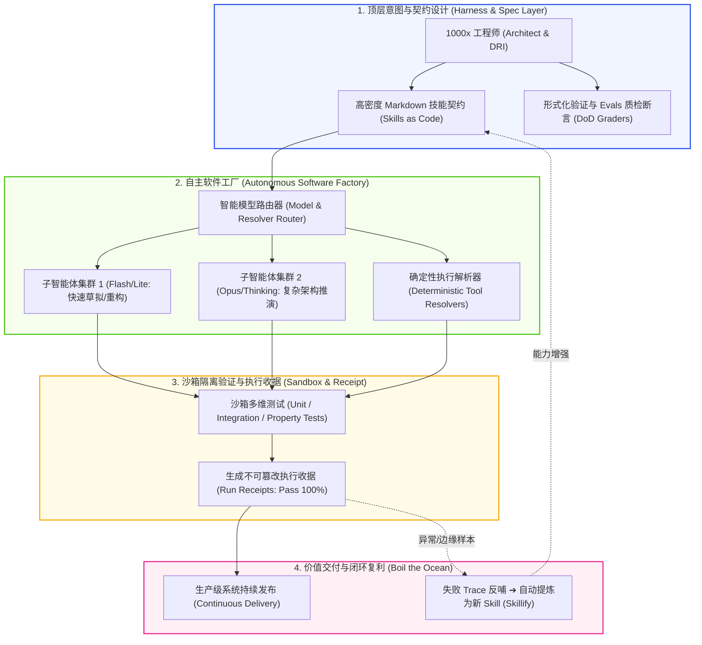

# 1000x工程师 (1000x Engineer: Autonomous Software Factory Commander)

> [!NOTE] Core Thesis
> **核心论点 (Core Thesis):** **1000x 工程师（1000x Engineer）**指在智能体软件工厂与闭环自治循环（Autonomous Loops）支撑下，生产率实现上千倍跃迁的现代开发者。他们彻底放弃在微观层面上逐行拼写、手动调试与肉眼审查代码的低效模式，升阶为**“自主软件工厂的最高指挥官与约束架构师（Harness Architect）”**：通过编写高密度 Markdown 技能契约（Skills as Code）、编排多模型分层路由、部署确定性沙箱断言与评估闭环（Evals），达成**单人在一个终端前“煮沸海洋（Boil the Ocean）”**——以数天时间交付传统数十人研发团队需耗时数年方能完成的生产级复杂分布式系统。
> (Source: [[sources/2026-06/2026-06-21-yc-garry-tan-diana-hu-stanford-cs153#^yc-boil-the-ocean]], [[sources/2026-08/2026-08-11-stanford-cs153-ai-native-company#^cs153-roles]])
^1000x-engineer-core-thesis

> [!INFO] Temporal Scope
> Valid as of **2026-08-19** · freshness tier **stable** · next review **2027-08-19**.

---

## 证据范围 (Evidence Scope)

- **直接证据 (Direct Evidence):**
  1. Y Combinator 总裁 Garry Tan 在斯坦福 CS153 披露，其借助 Claude Code 编排智能体，单人 5 天重构了 2008 年需 10 人工程师团队全职研发 2 年的完整 Posterous 生产系统，纯时间跨度效率提升达 **146x**。(Source: [[sources/2026-06/2026-06-21-yc-garry-tan-diana-hu-stanford-cs153#^yc-boil-the-ocean]])
  2. 前 Google 资深工程师 Steve Yegge 与 Tessl 团队实证，当工程流水线接入全自动化沙箱测试、执行收据（Run Receipts）与形式化断言后，人类开发者人均产出代码量与交付能力可达 **500 - 1000 人研发当量**。(Source: [[sources/2026-08/2026-08-11-stanford-cs153-ai-native-company#^cs153-market-growth]])
- **主观解释 (Interpretation):** 传统软件工程视“扩大开发范围（Scope Creep）”为大忌，但在零边际智能成本时代，1000x 工程师通过大规模并行智能体可以直接构建覆盖全业务边界的“柏拉图式理想架构（Platonic Ideal Architecture）”。
- **证据边界 (Evidence Boundary):** 该效率倍数高度依赖于工程底座是否具备**高覆盖率自动化测试套件（Evals）**与**明确的模块化接口（MECE Boundaries）**；在缺乏测试基准或依赖高度模糊的人际政治沟通场景中，效率增益会受制于“编排税（Orchestration Tax）”。
- **反证条件 (Falsifiers):** 若大规模部署智能体生成的代码在长期维护中产生无法定位的幽灵依赖雪崩，且总维护工时超过传统团队重写成本，则该范式需重新校准。
- **精确来源锚点 (Exact Locators):**
  - 煮沸海洋与效率跨度：[[sources/2026-06/2026-06-21-yc-garry-tan-diana-hu-stanford-cs153#^yc-boil-the-ocean]]
  - 智能体角色与工厂分工：[[sources/2026-08/2026-08-11-stanford-cs153-ai-native-company#^cs153-roles]]
  - 追踪回放与 Evals 质检线：[[sources/2026-08/2026-08-11-stanford-cs153-ai-native-company#^cs153-trace-evals]]
  - 前线部署与真实业务回流：[[sources/2026-08/2026-08-11-stanford-cs153-ai-native-company#^cs153-forward-deploy]]

---

## 核心机制 (Core Mechanisms)

### 1. 极致抽象与契约化编程 (High-Level Abstraction via Skills)
- **机制原理**：1000x 工程师绝不把精力耗费在语法琐事或 API 参数拼接上，而是通过结构化的 Markdown 契约（如 `RULE.md`、`SKILL.md`）定义顶层语义与因果边界，将开发行为提升为对智能体集群的“策略引导”。(Source: [[sources/2026-06/2026-06-21-yc-garry-tan-diana-hu-stanford-cs153#^yc-boil-the-ocean]])

### 2. 软件工厂与做梦沉淀 (Software Factory & Skillify Flywheel)
- **机制原理**：将软件开发解构为可自动复现的流水线。每当智能体成功攻克复杂未见场景，系统通过 `Skillify` 机制自动提取执行 Traces 中的成功模式，沉淀为新的确定性 Skill，实现系统工程能力的指数级自我复合。(Source: [[sources/2026-08/2026-08-11-stanford-cs153-ai-native-company#^cs153-trace-evals]])

### 3. 煮沸海洋与全域覆盖 (Boil the Ocean Paradigm)
- **机制原理**：由于智能体执行边际成本趋近于零，开发者可以直接并行调度上百个子智能体，在数小时内同时构建数据引擎、前端界面、测试套件、监控面板与国际化支持，彻底消除传统敏捷开发因人力不足而遗留的“技术债务黑洞”。(Source: [[sources/2026-06/2026-06-21-yc-garry-tan-diana-hu-stanford-cs153#^yc-boil-the-ocean]])

### 4. 自适应推理预算路由 (Adaptive Compute & Model Routing)
- **机制原理**：对低复杂度的简单 CRUD 与文本格式转换调用极轻量模型（Flash/Haiku）瞬时完成；对核心架构、高并发调度与算法优化动态分配重度思考模型（Opus/Pro 深度推理），实现性能、质量与 Token 预算的最优平衡。(Source: [[sources/2026-08/2026-08-11-stanford-cs153-ai-native-company#^cs153-systems]])

---

## 范式对比矩阵 (Paradigm Matrix)

| 核心维度 | 传统工程师 (Legacy 1x-10x) | Copilot 开发者 (10x-100x) | 1000x 工程师 (V8.1 Gold Paradigm) |
| :--- | :--- | :--- | :--- |
| **底层假设** | 人脑是唯一的代码逻辑生成者与审查者 | AI 是代码补全助手，人类主导逐行交互 | 智能体集群是代码工人，人类是软件工厂架构师与裁判 |
| **核心活动** | 键盘敲击、查阅语法、配置环境、本地 Debug | Tab 键代码补全、Chat 窗口交互式追问提示 | 编写 Markdown 规范、配置 Evals 质检线、运行自治 Loop |
| **杠杆来源** | 个人语法熟练度、IDE 快捷键与算法记忆 | 代码块级自动生成、常用 SaaS 脚手架 | 智能体多表面编排（Antigravity/Codex）、执行收据与技能复利 |
| **质量保证** | 人工肉眼 Code Review，极易遗漏隐蔽逻辑 Bug | 人类审阅 AI 生成代码片段，认知负荷大 | **100% 确定性测试断言、沙箱变异测试与不可篡改收据** |
| **物理瓶颈** | ⚠️ 手指敲击速度与心智工作记忆（8h/天） | ⚠️ 提示词交互疲劳与上下文窗口溢出 | ⚠️ 编排税（人类审查系统级规格的物理极限） |

---

## 关键数据与实证 (Key Data)

- **真实案例 1 (Posterous 重构):** Garry Tan 借助 Claude Code 在 5 天内完成 100 万行代码重构，交付 2008 年需 10 人团队研发 2 年的系统，**纯时间跨度提速 146x**。
- **真实案例 2 (Tessl 软件工厂):** 达成一人管理 20+ 并发自主智能体流水线，每周交付 50+ 个通过全部测试收据的微服务特性。
- **人效乘数:** 经验证的真实产出相当于 **500 - 1000 名传统工程师** 的研发当量（需由自动化测试覆盖率与最终业务结果锚定）。(Source: [[sources/2026-06/2026-06-21-yc-garry-tan-diana-hu-stanford-cs153#^yc-boil-the-ocean]], [[sources/2026-08/2026-08-11-stanford-cs153-ai-native-company#^cs153-market-growth]])

---

## 应用与工程含义 (Implications & SOP)

- **1000x 工程师跃迁 5 步 SOP:**
  1. **前线探查与痛点捕获 (Forward Deploy):** 亲自介入最痛苦的实际业务流，提取前线真实 Traces 与边界约束，拒绝纸上谈兵。(Source: [[sources/2026-08/2026-08-11-stanford-cs153-ai-native-company#^cs153-forward-deploy]])
  2. **契约固化 (Write Skills as Code):** 将经验提炼为标准 Markdown 契约，明确输入输出 Schema、禁止项与确定性判定标准。
  3. **搭建断言防线 (Build Evals First):** 在让 AI 编写业务代码前，优先编写高覆盖率的单元测试、属性测试与端到端沙箱评测集。
  4. **发射自主闭环 (Launch Autonomous Loop):** 启动 `Trigger -> Execute -> Verify -> Commit` 自治循环，让智能体在沙箱中自行纠错直至 100% 通过。
  5. **审查收据而非代码 (Audit Receipts, Not Code):** 只审查测试收据、运行日志与架构边界；将所有偶发错误转化为新的治理测试用例。

---

## 概念网络连接 (Connections)

- **领域 MOC:** [[maps/domain-mocs/AI 知识工作流]]
- **关联人物:** [[wiki/entities/people/Garry Tan]]、[[wiki/entities/people/Diana Hu]]、[[wiki/entities/people/Steve Yegge]]、[[wiki/entities/people/Don Syme]]、[[wiki/entities/people/Ian Silber]]
- **关联核心概念:**
  - [[wiki/concepts/ai-engineering/循环工程 Loop Engineering|循环工程 Loop Engineering]] — 1000x 工程师的基础控制论自愈战术循环
  - [[wiki/concepts/ai-engineering/Continuous AI, Repository Software Factories & Bounded Agentic Workflows|Continuous AI 与代码仓库软件工厂]] — 1000x 工程师操作的代码工厂基础设施
  - [[wiki/concepts/ai-engineering/Graph Engineering Topology & Node-Capability Evolution|图工程拓扑与节点能力演进]] — 1000x 工程师调度百智能体并发 DAG 的编排范式
  - [[wiki/concepts/ai-engineering/Vibe Coding|Vibe Coding (氛围编码)]] — 极速原型探索与演示-生产隔离防线
  - [[wiki/concepts/ai-engineering/多人 Agent 共享上下文与协作表面|多人 Agent 共享上下文与协作表面]] — 团队级统一协作表面与多智能体上下文水合
  - [[wiki/concepts/ai-engineering/Top 1% AI Workflows, Executive Planning Systems & Multi-Agent Workspaces|前 1% AI 工作流与多智能体工作区]] — 超级个体的智能体工作区规划与排期体系
  - [[wiki/concepts/ai-engineering/黑灯软件工厂与自主代码编排|黑灯软件工厂与自主代码编排]] — 1000x 工程师操作的无人工黑灯生产线
  - [[wiki/concepts/ai-engineering/智能体持久化记忆架构与混合检索|智能体持久化记忆架构与混合检索]] — 支撑长程多智能体协作的记忆中枢
  - [[wiki/concepts/ai-engineering/个人AGI三位一体架构：Agent+Skills+Obsidian|个人AGI三位一体架构：Agent+Skills+Obsidian]] — 1000x 工程师的核心装备体系
  - [[wiki/concepts/ai-engineering/编排税|编排税 (Orchestration Tax)]] — 1000x 工程师在规模化扩张中必须治理的核心阻力
- **不可变来源:**
  - [[sources/2026-06/2026-06-21-yc-garry-tan-diana-hu-stanford-cs153]]
  - [[sources/2026-08/2026-08-11-stanford-cs153-ai-native-company]]
  - [[sources/2026-08/src-20260818-tessl-don-syme-github-every-repo-software-factory]]

---

## 演化时间线 (Evolution Timeline)

- **2026-06-21:** 基于 Garry Tan 与 Steve Yegge 关于 1000x 工程师效率跨度与 OpenClaw 实践的探讨创建初始卡片。
- **2026-08-11:** 复用 Stanford CS153 时间戳剪藏副本，补充 Builder/DRI 分工、Trace-to-Eval 闭环与前线部署证据。
- **2026-08-17:** 按照第三大脑 V8.1 Gold-Standard 规范全面重构升级，确立“自主软件工厂指挥官”的系统化定义与 5 步实战 SOP。
